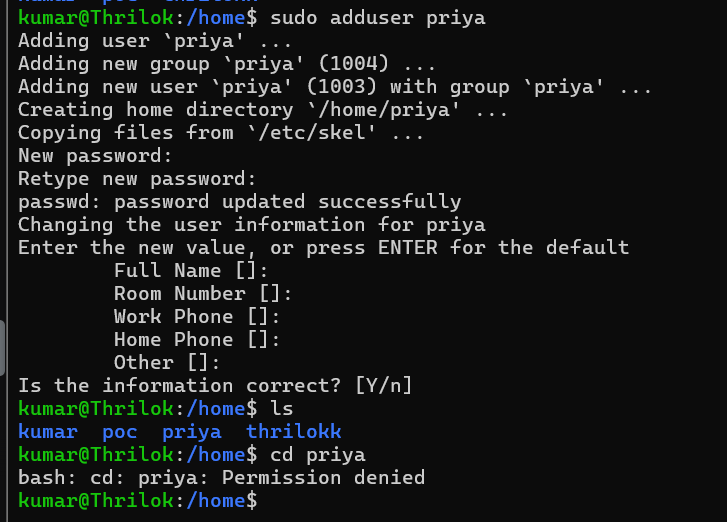

How to create new user in Linux enviornment

The most common way to create a new user in linux by using the command

- Command: sudo useradd priya

- it will ask password to enter 

- or

- if its dont ask, please enter password like this sudo passwd priya and enter password.

- To switch between users you can use this command- su thrilokk and it will switch to another user

| Number  |	Permission |
| -----   | ---------- |
| 0	      | ---        |
| 1	      | --x        |
| 2	      | -w-        |
| 3	      | -wx        |
| 4	      | r--        |
|5	      | r-x        |
|6 	      | rw-        |
|7	      | rwx        |

